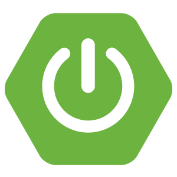

<h1 align="center">
  &nbsp;&nbsp;&nbsp;
  
</h1>

<h3 align="center">
  Curso de API REST com Spring Boot no Back-end e Vue.js no Front-end
</h3>

<p align="center">Desenvolvimento de uma API REST com Spring Boot no Back-end e Vue.js no Front-end</p>

<p align="center">Por Michelli Brito (Back-end) e Samuelson Brito - Descompila (Front-end)</p>

<p align="center">
  <a href="#como-executar-o-projeto">Como executar o projeto</a>&nbsp;&nbsp;&nbsp;|&nbsp;&nbsp;&nbsp;
  <a href="#configurações-de-ferramentas">Configurações de Ferramentas</a>
</p>

<p align="center">Back-end</p>

<p align="center">
  
</p>

<p align="center">Swagger</p>

<p align="center">
  
</p>

<p align="center">Front-end</p>

<p align="center">
  
</p>

## Como executar o projeto

### Back-end

#### Requisitos

- [Java SDK 11](https://www.oracle.com/java/technologies/javase-jdk11-downloads.html) ou versões posteriores
- [Banco de Dados MySQL](https://www.mysql.com)
- [Eclipse](https://www.eclipse.org/downloads/packages) ou [Marven](https://maven.apache.org)

#### Opcional

- [Docker](https://www.docker.com)
- [Insomnia](https://insomnia.rest)

#### Passos para a configuração

**1. Clonar este repositório**

```bash
git clone https://github.com/eliasmcastro/michelli-brito-descompila-youtube-spring-boot-vue.git
```

**2. Criar um banco de bados MySQL**

```bash
create database apirest
```

**3. Alterar usuário e senha MySQL de acordo com sua instalação**

- abrir `backend/src/main/resources/application.properties`

- alterar (se necessário) o host:porta e nome do banco de dados em `spring.datasource.url= jdbc:mysql://HOST:PORTA/NOME_BANCO_DADOS`

- alterar `spring.datasource.username` e `spring.datasource.password` de acordo com sua instalação do MySQL

**4. Executar aplicação**

Se for executar pelo Eclipse

- abrir o Eclipse -> File -> Import -> Existing Marven Projects (clicar em Next) -> Selecionar a pasta backend do projeto (clicar em Finish)

- executar Application.java (src/com.produtos.apirest) para iniciar o backend da aplicação

Se for executar com o Maven

- Entrar na pasta backend (pelo cmd/terminal)
- Executar o comando abaixo para iniciar o backend da aplicação

```bash
mvn spring-boot:run
```

O aplicativo começará a ser executado em http://localhost:8080

_Dica: utilizar o Insomnia para testar as rotas_

- Abrir o Insomnia -> Application -> Preferences -> Data -> Import Data -> From File -> Selecionar o arquivo insomnia.json que está na pasta backend

### Swagger

#### Requisitos

- O back-end está sendo executado

#### Passos para a configuração

Acessar http://localhost:8080/swagger-ui.html

### Front-end

#### Requisitos

- [Node.js](https://nodejs.org)
- O back-end está sendo executado

#### Passos para a configuração

**1. Executar aplicação**

- Entrar na pasta frontend (pelo cmd/terminal)
- Executar o comando abaixo para instalar as dependências do projeto

```bash
npm install
```

- Executar o comando abaixo para iniciar o servidor

```bash
npm run serve
```

Acessar http://localhost:8081

## Configurações de Ferramentas

### Back-end

#### [Java SDK 11](https://www.oracle.com/java/technologies/javase-jdk11-downloads.html) no Windows

- Efetuar o download do executável de acordo com o seu sistema operacional
- _Obs: será necessário realizar um login (criar uma conta caso não possuir) para baixar_
- Realizar a instalação
- Configuar o caminho da instalação do Java nas variáveis de ambiente do Windows de acordo com esse [tutorial](https://medium.com/@mauriciogeneroso/configurando-java-4-como-configurar-as-vari%C3%A1veis-java-home-path-e-classpath-no-windows-46040950638f)

#### [Eclipse](https://www.eclipse.org/downloads/packages)

- Efetuar o download do Eclipse. Recomenda-se utilizar a versão (package) Eclipse IDE for Enterprise Java Developers
- Extrair o zip para uma pasta em seu computador

#### [Marven](https://maven.apache.org)

- Realizar a instação e configuração do marven conforme esse [tutorial](https://www.devmedia.com.br/introducao-ao-maven/25128#2)

#### Start Spring

- Este site [https://start.spring.io](https://start.spring.io/) ajuda na criação de um novo projeto Spring Boot

#### [Docker](https://www.docker.com) & MySQL

- Realizar a instalação do docker
- O Docker permite fazer a conteinerização (máquinas virtuais) de recursos de softwares dentro da nossa máquina
- No Win 10, durante a instalação vai ter uma opção `se você quer utilizar containers com sistema windows ao invés de linux`, não clicar nessa opção. Deixar realizar a instalação do `Hyper -v`
- Executar `docker` para verificar se a instalação deu certo
- Executar `docker pull mysql` para baixar a máquina virtual do MySQL
- Executar `docker run --name apirestspringboot -p 3306:3306 -e MYSQL_ROOT_PASSWORD=senha -d mysql:latest` para criar uma instância do MySQL
  - `apirestspringboot` é o nome do container que iremos criar
  - `-p` serve para fazer o redirecionamento da porta `3306` do sistema operacional do computador para a porta `3306` da máquina virtual
  - `-e` serve para definir qual será a senha do usuário root do MySQL
  - `-d` serve para selecionar qual imagem iremos utilizar
- Executar `docker ps` para exibir quais containers estão rodando
- Executar `docker ps -a` para exibir quais containers que estão pausados
- Executar `docker start apirestspringboot` para subir o container que está pausado
  - `apirestspringboot` é o nome do container
  - _Obs: Pode ser utilizado algum software para ter acesso ao banco de dados, uma sugestão seria o MySQL Workbench_
  - Os dados para conexão será
    - HOST: 127.0.0.1
    - PORT: 3306
    - USER: root
    - PASS: a senha que foi definida no momento da criação da instância

#### [Insomnia](https://insomnia.rest)

- O Insomnia serve para testar a API
- Efetuar o download e realizar a instalação

### Front-end

#### [Node.js & NPM](https://nodejs.org)

- Uma sugestão para a instação do Node.js é realizar via [package manager](https://nodejs.org/en/download/package-manager) utilizando o Chocolatey no Windows
  - Instalar o [Chocolatey](https://chocolatey.org/install)
  - Executar `cinst nodejs-lts` para instalar o Node.js
  - Executar `node -v` e `npm -v` para verificar se a instalação deu certo

#### [Vue CLI](https://cli.vuejs.org)

- Executar `npm install -g @vue/cli` para realizar a instalação do Vue CLI globalmente
- Executar `vue --version` para verificar se a instalação deu certo

#### [Visual Studio Code](https://code.visualstudio.com)

- O Visual Studio Code é um editor de código-fonte
- Efetuar o download e realizar a instalação
